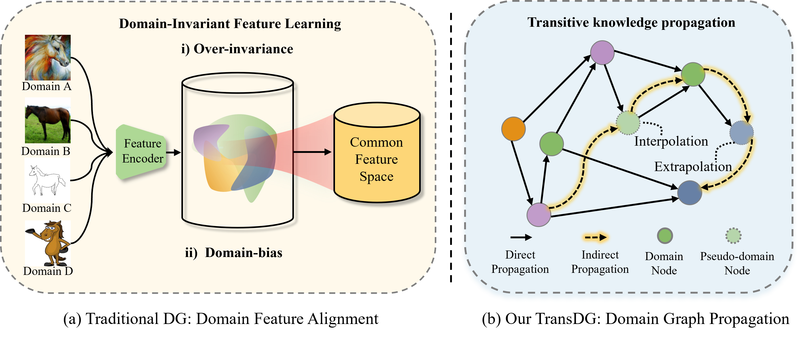
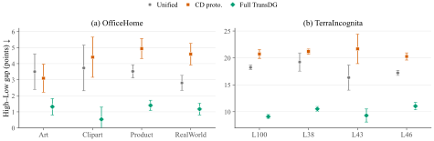
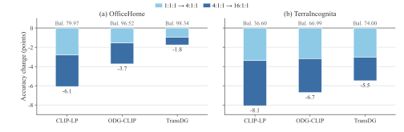
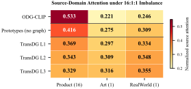
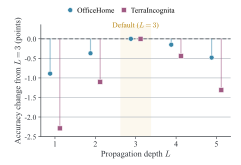
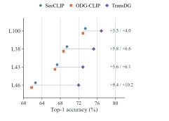

# TransDG

## Commonality without Uniformity: Domain Generalization via Transitive Knowledge Transfer over Adaptive Domain Graph

TransDG addresses over-invariance and dominant-domain bias in domain
generalization. Instead of collapsing all source domains into a single
representation, the method constructs class-domain prototypes that preserve
class-consistent domain variation. Interpolated and extrapolated pseudo-domain
anchors expand the observed domain manifold, and an adaptive graph supports
direct and transitive knowledge transfer among the resulting anchors.



## Scope and result provenance

This repository provides a reconstructed implementation of the complete
OfficeHome leave-one-domain-out pipeline described in the manuscript and
appendix. It includes both optimization stages, prototype construction and
expansion, graph propagation, source-only model selection, target evaluation,
and formula-level tests. The numerical results below are transcribed from the
paper and appendix and are reported as reference values; they are not outputs
of the smoke test. Dataset-specific entry points for PACS, VLCS,
Mini-DomainNet, and TerraIncognita are outside the scope of this release.

At every graph propagation layer, the visual instance state receives textual
messages and the textual instance state receives visual messages. Both states
are updated synchronously, while the prototype anchors remain fixed. The
cross-modal bridge is therefore part of recurrent propagation rather than a
post-hoc alignment operation applied after the final layer.

## Results reported in the paper

Unless stated otherwise, all benchmark values are closed-set top-1 accuracy
(%). Results follow the standard leave-one-domain-out protocol and are averaged
over held-out target domains and three random seeds. A dash indicates that the
corresponding result was not reported by the cited method.

### Main comparison

| Method | Family | PACS | VLCS | OfficeHome | Mini-DomainNet | TerraIncognita |
|---|---|---:|---:|---:|---:|---:|
| SWAD | CNN | 88.10 | 79.10 | 70.60 | - | 50.00 |
| EoA | CNN | 88.60 | 79.10 | 72.50 | - | 52.30 |
| SAGM | CNN | 86.60 | 80.00 | 70.10 | - | 48.80 |
| CLIPood | Recent VLM | 97.30 | 85.00 | 87.00 | - | 60.40 |
| CLIPCEIL++ | Recent VLM | 97.20 | 85.20 | 87.70 | - | 62.00 |
| DGCLDTP | Recent VLM | 97.03 | 84.79 | 87.65 | - | 63.27 |
| RD-MLDG | Recent VLM | 98.13 | 87.03 | 91.73 | - | 70.65 |
| CLIP | CLIP ViT-B/32 | 94.89 | 82.14 | 78.40 | 78.73 | - |
| CoOp | CLIP ViT-B/32 | 97.11 | 83.34 | 81.33 | 72.30 | - |
| CoCoOp | CLIP ViT-B/32 | 96.54 | 85.02 | 81.05 | 71.51 | - |
| MaPLe | CLIP ViT-B/32 | 97.72 | 86.75 | 83.52 | 73.87 | - |
| PromptSRC | CLIP ViT-B/32 | 98.02 | 86.34 | 83.89 | 76.10 | - |
| StyLIP | CLIP ViT-B/32 | 98.17 | 87.21 | 85.94 | 80.43 | - |
| ODG-CLIP | CLIP ViT-B/32 | 99.83 | 95.74 | 96.91 | 96.65 | 67.55* |
| SeeCLIP | CLIP ViT-B/32 | 99.89 | 96.52 | 97.43 | 97.28 | 68.20* |
| **TransDG** | **CLIP ViT-B/32** | **99.93** | **96.89** | **98.61** | **98.53** | **74.27** |

`*` denotes our reproduction on TerraIncognita. The remaining baseline entries
follow the values cited in the main manuscript.

### Preserving domain structure

The class-domain prototypes preserve source-specific modes that are suppressed
by a unified class center. In the diagnostic UMAP visualization below, colors
denote classes, marker styles denote domains, and stars denote prototypes. The
visualization is not used for training or model selection.


Target examples are further partitioned into high-, mid-, and low-affinity
groups according to their source-anchor affinity. `Gap` is the difference
between high- and low-affinity accuracy; a smaller value indicates more uniform
performance across affinity strata. Group accuracies are weighted by group size
within each target domain and then macro-averaged over targets and seeds.

| Dataset | Representation | High | Mid | Low | All | Gap |
|---|---|---:|---:|---:|---:|---:|
| OfficeHome | Unified class center | 94.37 | 93.19 | 90.98 | 92.84 | 3.39 |
| OfficeHome | Class-domain prototypes | 97.16 | 95.73 | 92.91 | 95.26 | 4.25 |
| OfficeHome | **Full TransDG** | **99.04** | **98.86** | **97.93** | **98.61** | **1.11** |
| TerraIncognita | Unified class center | 68.51 | 61.82 | 50.76 | 60.37 | 17.75 |
| TerraIncognita | Class-domain prototypes | 74.68 | 67.04 | 53.71 | 65.14 | 20.97 |
| TerraIncognita | **Full TransDG** | **79.33** | **74.16** | **69.34** | **74.27** | **9.99** |



### Robustness to source-domain imbalance

The appendix reports the mean and sample standard deviation over three seeds.
`Full` retains all source-training examples, whereas `1:1:1` equalizes the
source domains to the smallest training pool. For `r:1:1`, one source remains
at full size and each minority source is subsampled to `floor(n_dom / r)`. The
dominant source is rotated, while source-validation and target sets remain
fixed. `Drop` is the decrease from `1:1:1` to `16:1:1`.

| Dataset | Method | Full | 1:1:1 | 4:1:1 | 16:1:1 | Drop |
|---|---|---:|---:|---:|---:|---:|
| OfficeHome | CLIP-LP | 80.35 &plusmn; 0.07 | 79.97 &plusmn; 0.06 | 77.16 &plusmn; 0.06 | 73.89 &plusmn; 0.08 | 6.08 |
| OfficeHome | ODG-CLIP | 96.91 &plusmn; 0.06 | 96.52 &plusmn; 0.04 | 94.96 &plusmn; 0.03 | 92.79 &plusmn; 0.07 | 3.74 |
| OfficeHome | **TransDG** | **98.61 &plusmn; 0.07** | **98.34 &plusmn; 0.08** | **97.37 &plusmn; 0.07** | **96.59 &plusmn; 0.05** | **1.76** |
| TerraIncognita | CLIP-LP | 37.48 &plusmn; 0.05 | 36.60 &plusmn; 0.14 | 33.21 &plusmn; 0.12 | 28.52 &plusmn; 0.09 | 8.08 |
| TerraIncognita | ODG-CLIP | 67.55 &plusmn; 0.04 | 66.99 &plusmn; 0.09 | 63.80 &plusmn; 0.17 | 60.28 &plusmn; 0.01 | 6.71 |
| TerraIncognita | **TransDG** | **74.27 &plusmn; 0.05** | **74.00 &plusmn; 0.03** | **70.96 &plusmn; 0.06** | **68.52 &plusmn; 0.11** | **5.48** |



Under the `16:1:1` OfficeHome setting, Product is the dominant source, Art and
RealWorld are minority sources, and Clipart is held out. From `L=1` to `L=3`,
the normalized attention assigned to Product decreases from 0.369 to 0.329,
while the weights assigned to both minority sources increase. This redistribution
is consistent with the reduced accuracy degradation under source imbalance.



### Component ablations

The cumulative study shows how prototype granularity, pseudo-domain expansion,
and multi-hop propagation contribute to the final model.

| Configuration | OfficeHome | TerraIncognita | Average |
|---|---:|---:|---:|
| Unified class center | 92.84 | 60.37 | 76.61 |
| + class-domain prototypes | 95.26 | 65.14 | 80.20 |
| + pseudo-domain expansion | 97.05 | 70.15 | 83.60 |
| + direct propagation (`L=1`) | 97.72 | 71.98 | 84.85 |
| + transitive propagation (`L=3`) | **98.61** | **74.27** | **86.44** |

Interpolation and extrapolation are complementary:

| Expansion strategy | OfficeHome | TerraIncognita | Average |
|---|---:|---:|---:|
| Class-domain prototypes only | 95.26 | 65.14 | 80.20 |
| + interpolation | 95.58 | 65.42 | 80.50 |
| + extrapolation | 96.32 | 68.46 | 82.39 |
| + both | **97.05** | **70.15** | **83.60** |

The objective ablation removes one loss from the complete model at a time:

| Objective | OfficeHome | TerraIncognita | Average |
|---|---:|---:|---:|
| Without source classification loss | 98.23 | 72.96 | 85.60 |
| Without prototype consistency loss | 98.66 | 73.42 | 86.04 |
| Without transitive graph loss | 97.84 | 72.18 | 85.01 |
| **Full objective** | **98.61** | **74.27** | **86.44** |

### Propagation depth

The default depth `L=3` yields the highest average accuracy in the reported
sweep. Performance decreases for `L>3`, consistent with excessive propagation
attenuating discriminative domain structure.

| Depth `L` | OfficeHome | TerraIncognita | Average |
|---:|---:|---:|---:|
| 1 | 97.72 | 71.98 | 84.85 |
| 2 | 98.24 | 73.17 | 85.71 |
| **3** | **98.61** | **74.27** | **86.44** |
| 4 | 98.46 | 73.83 | 86.15 |
| 5 | 98.13 | 72.96 | 85.55 |



### TerraIncognita by target location

Values are mean and sample standard deviation over three seeds. The final
average is computed across locations within each seed.

| Method | L100 | L38 | L43 | L46 | Average |
|---|---:|---:|---:|---:|---:|
| SeeCLIP* | 73.46 &plusmn; 0.17 | 69.43 &plusmn; 0.18 | 67.31 &plusmn; 0.19 | 62.59 &plusmn; 0.20 | 68.20 &plusmn; 0.09 |
| ODG-CLIP* | 72.92 &plusmn; 0.03 | 68.70 &plusmn; 0.13 | 66.83 &plusmn; 0.08 | 61.74 &plusmn; 0.16 | 67.55 &plusmn; 0.04 |
| **TransDG** | **76.92 &plusmn; 0.05** | **75.26 &plusmn; 0.04** | **72.91 &plusmn; 0.10** | **71.98 &plusmn; 0.04** | **74.27 &plusmn; 0.05** |

`*` denotes our reproduction. The gain is largest on L46, the hardest target
location: 9.38 points over SeeCLIP and 10.23 points over ODG-CLIP.



### Inference efficiency

Latency was measured on one NVIDIA GeForce RTX 4090 with batch size 1 and does
not include data loading. Memory is PyTorch peak allocated CUDA memory.

| Dataset | Classes | Latency (ms/image) | Peak memory (GiB) |
|---|---:|---:|---:|
| VLCS | 5 | 27.2 | 1.39 |
| PACS | 7 | 35.6 | 1.47 |
| TerraIncognita | 10 | 49.7 | 1.60 |
| OfficeHome | 65 | 302.8 | 3.72 |
| Mini-DomainNet | 126 | 574.3 | 5.86 |

## Installation and verification

Install the dependencies:

```text
python -m pip install -r requirements.txt
```

Run the implementation tests:

```text
python smoke_test.py
```

A successful run terminates with:

```text
SMOKE_OK: 8 core tests passed
```

The smoke test does not require OfficeHome or a CLIP checkpoint. It validates
prototype counts, the losses corresponding to Eqs. (13) and (20), the graph
parameter count, result aggregation, and the bidirectional instance bridge at
every propagation layer. These tests verify implementation-level invariants;
they do not reproduce the benchmark accuracies reported above.

## Environment

The reported experiments used Python 3.9.13, PyTorch 2.4.0, torchvision
0.19.0, and CUDA 12.1 on one NVIDIA GeForce RTX 4090. Remaining dependencies
are listed in `requirements.txt`. The smoke test also passes with PyTorch 2.5.1,
torchvision 0.20.1, and NumPy 2.2.6.

## Data and checkpoint

Full training needs a local OfficeHome dataset and a local CLIP ViT-B/32
checkpoint. Neither is included in this repository.

```text
TransDG/
  ViT-B-32.pt
  data/OfficeHome/
    Art/<class_name>/<image>
    Clipart/<class_name>/<image>
    Product/<class_name>/<image>
    RealWorld/<class_name>/<image>
```

The checkpoint used in our tests has this SHA-256 value:

```text
40d365715913c9da98579312b702a82c18be219cc2a73407c4526f58eba950af
```

OfficeHome contains 65 classes across four domains. Keep the original class
directory names; the loader searches each class directory recursively for JPG,
JPEG, and PNG files.

Validate the dataset split without loading CLIP:

```text
python train.py --dry-run --lodo Art --seeds 108
```

Run one held-out domain with one seed:

```text
python train.py --lodo Art --seeds 108 \
  --dataset-root ./data/OfficeHome --model-path ./ViT-B-32.pt
```

Run all four target domains with the three reported seeds:

```text
python train.py --lodo all --seeds 108 113 115 \
  --dataset-root ./data/OfficeHome --model-path ./ViT-B-32.pt
```

Candidate-conditioned visual enhancement is evaluated in class chunks. The
default `--visual-class-chunk-size 1` minimizes peak memory. Larger values may
increase throughput when additional GPU memory is available without changing
the underlying computation.

## Training protocol

For each random seed and held-out OfficeHome target domain, the implementation:

1. splits every source class-domain group into 80% training and 20% validation;
2. trains adaptive prompts and visual enhancement for 15 epochs while keeping
   both CLIP encoders frozen;
3. applies the complete reliability-weighted matched-prototype consistency in
   Eq. (13), using bounded-memory mini-batch recomputation;
4. selects the Stage-I checkpoint using source validation only;
5. constructs and freezes the source-training prototype bank;
6. creates 3 real, 4 extrapolated, and 21 interpolated anchors per class;
7. trains the shared graph module for 10 epochs and selects its checkpoint with
   source validation only; and
8. evaluates once on the held-out target domain.

Target images and labels are excluded from training, prototype construction,
hyperparameter selection, and checkpoint selection. Within each local
class-conditioned graph, all real anchors and the three most relevant anchors
of each pseudo-domain type are retained.

The implementation checks the appendix parameter counts at runtime:

- Stage-I trainable modules: 12,378,705 parameters
- Shared graph module: 1,050,670 parameters

## Outputs

Results are written to `outputs/officehome/seed_<seed>/<target>/`. Each run
contains selected checkpoints, training histories, and a summary.
`all_results.json` records target-wise results, sample standard deviations, and
the overall domain average after all runs finish.

## Repository layout

```text
TransDG/
  assets/            README figures
  clip/              local CLIP implementation
  tests/             formula- and graph-level tests
  train.py           OfficeHome training and evaluation entry point
  transclip.py       frozen CLIP encoders, prompts, and visual enhancement
  smoke_test.py      lightweight implementation checks
  requirements.txt   Python dependencies
  NOTICE.md          notice for CLIP-derived source files
  LICENSE            MIT license for the original TransDG code
```

## License

The original TransDG code in this repository is released under the MIT License
in `LICENSE`. The CLIP-derived files under `clip/` retain their original license,
which is reproduced in `NOTICE.md`.
